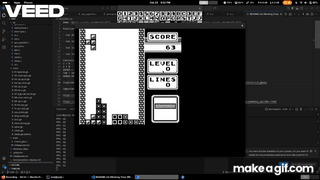

# Game Boy Emulator (C)

A Game Boy emulator written in **C** that recreates the hardware architecture
of the original Nintendo Game Boy, including CPU execution, memory bus
mapping, PPU rendering pipeline, and DMA transfers.

This project was built as a systems programming exercise to better understand
low-level hardware behavior such as memory-mapped IO, cycle-based execution,
and graphics pipelines.

---

## Demo



Video demo:  
https://youtu.be/3SjgRcNA9LI

---

## Features

Current functionality:

- Game Boy CPU instruction execution
- Memory bus emulation
- Background and sprite rendering
- Window rendering
- DMA sprite transfers
- Game input via keyboard
- Save state loading

Planned:

- Sound emulation
- Additional hardware accuracy improvements

---

## Architecture

The emulator models several subsystems of the original Game Boy hardware.

### CPU

Implements the **Game Boy LR35902 processor**, executing instructions from
ROM while maintaining cycle counts used by other hardware components.

### Memory Bus

The emulator routes memory reads and writes through a central bus which maps
addresses to the appropriate hardware component.

| Address Range | Component |
|---------------|-----------|
| 0x0000–0x7FFF | ROM |
| 0x8000–0x9FFF | VRAM |
| 0xA000–0xBFFF | Cartridge RAM |
| 0xC000–0xDFFF | WRAM |
| 0xFE00–0xFE9F | OAM (sprite memory) |
| 0xFF00–0xFF7F | IO Registers |
| 0xFF80–0xFFFE | HRAM |

### PPU (Graphics)

The emulator reproduces the Game Boy **scanline rendering pipeline**, which
renders the display line-by-line.

Each scanline progresses through the following modes:

- **OAM Search** – identify sprites on the current scanline
- **Pixel Transfer** – fetch background and sprite pixels
- **HBlank** – horizontal blank period
- **VBlank** – vertical blank period after frame rendering

Graphics rendering uses a **pixel FIFO pipeline** to process background,
window, and sprite pixels.

### DMA

DMA transfers allow rapid copying of sprite data from memory into OAM,
replicating the Game Boy's hardware sprite loading behavior.

---

## Controls

| Key | Game Boy Button |
|----|----|
| Z | A |
| X | B |
| Enter | Start |
| Tab | Select |
| Arrow Keys | D-Pad |

---

## Building the Project

### Linux

Requirements:

- CMake
- SDL2

Build:

```bash
mkdir build
cd build
cmake ..
make